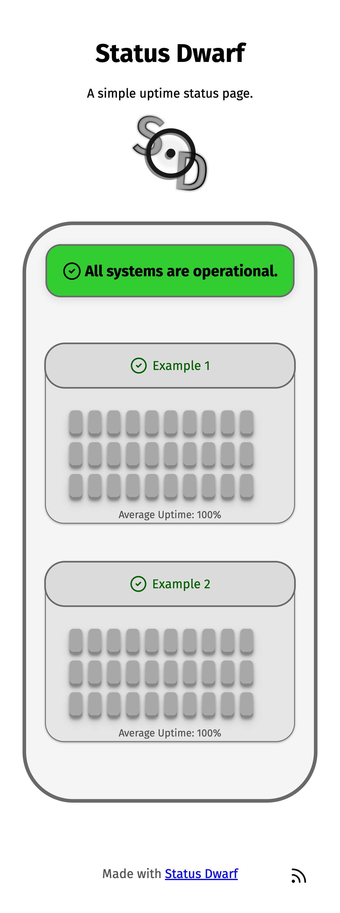

# Status Dwarf

A simple uptime status page.


## Key Features

- Simple
- Minimal
- Easily customizable with [configuration](status_dwarf/config/config_base.json) options
- Proper mobile and dark mode support

## Screenshots

Here is how it looks like.

<details>
    <summary>Desktop</summary>


</details>

<details>
    <summary>Mobile</summary>




</details>

## Installation

Clone the repository, create a virtual environment and install the requirements by running:

```
git clone https://github.com/cosmicproc/status_dwarf
python3 -m venv .venv
source .venv/bin/activate
pip3 install -r requirements.txt
```

Enter the project directory. Copy and paste the [base config file](status_dwarf/config/config_base.json) to config.json
in the same directory. Then set up that config file according to your needs. After setting up the config
file run:

```
flask --app status_dwarf commands sync_targets
```

This command synchronizes the targets you set in the config file with the database. It is the only config option that
requires explicit action since it can delete data.

### Docker

Build the Docker container:

```
docker build .
```

### Non-Docker

The ```ping``` command is required for ICMP (PING) targets. Make sure it's available.
Install gunicorn (you can also use something else if you wish) by running:

```
pip3 install gunicorn
```

To start the app, just run:

```
gunicorn "status_dwarf:create_app()"
```

You should probably create a systemd service to automatically start the app.
See [here](https://docs.gunicorn.org/en/stable/deploy.html?highlight=systemd#systemd) for more information.

### Note

In most cases you will want to run the app behind a reverse proxy and serve static files with an HTTP server.
See [here](https://docs.gunicorn.org/en/stable/deploy.html#deploying-gunicorn) for more information about deploying
gunicorn. The static files that app uses can be found in [here](status_dwarf/static).

## Customization

Most customization is done through the [config file](status_dwarf/config/config_base.json). See
the [config documentation](status_dwarf/config/config.md) for more details.

Here are some other possible customizations that can be made relatively easily:

- To translate the app, copy and paste the [base translation file](status_dwarf/i18n/i18n_base.json)
  into the [i18n.json](status_dwarf/i18n/i18n.json) file. Then replace the values of the file to their counterparts in
  the desired language. Make sure translation is enabled (```TRANSLATION_ENABLED``` option) in the config file.
- To change the images (like the one under the header in the home page), you can modify the
  images [here](status_dwarf/static/images).
- To change the color scheme, edit the variables at the top of the [style.css](status_dwarf/static/css/style.css) file.
- To change the font, put your desired font in the [fonts directory](status_dwarf/static/fonts) and tweak
  the [fonts.css](status_dwarf/static/css/fonts.css) file.

## Updating

Clone the repository:

```
git clone https://github.com/cosmicproc/status_dwarf
```

Apply your modifications (like the config file) again to the new repository.
Make sure that new repository uses the intended database.

Apply the database migrations:

```
flask --app status_dwarf db upgrade
```

### Note

You may want to fork the repository and apply your changes there instead.
That way, you can make your modifications in your fork and update simply by merging the changes, running ```git pull```
and migrating the database. Keep in mind that the config.json file is ignored by git. If you want to track that file,
remove it from the [gitignore](.gitignore).

## Credits

- Lucide Icons (https://lucide.dev)
- Fira Sans (https://github.com/mozilla/Fira)
- And other dependencies listed in [requirements.txt](requirements.txt).
